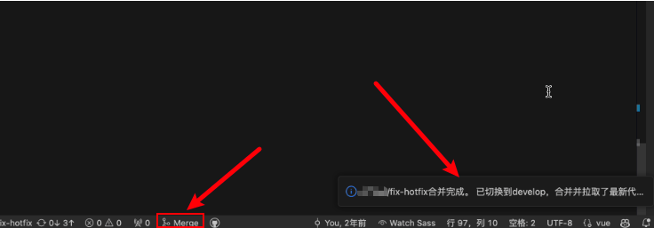

# vscode-merge-branch-button

自动合并代码到develop分支的VSCode插件

## steps
1. 检查当前是否有未提交的更改
  1. 存在未提交的更改则提示用户提交更改
  2. 不存在未提交的更改则继续下一步
2. 切换到 develop 分支
3. 拉取 develop 分支最新代码
3. 合并分支到 develop 分支
4. 推送代码到 develop 分支
5. 切换回当前分支

## Usage

