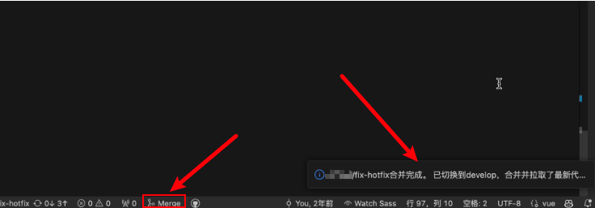

# vscode-merge-branch-button

<a href="https://marketplace.visualstudio.com/items?itemName=brokenbonesdd.vscode-merge-branch-button" target="__blank"></a>

VSCode插件：一键合并当前分支到指定目标分支（默认develop）

## 功能
- 一键合并当前分支到目标分支
- 可配置目标分支名称
- 合并过程中按钮禁用，避免重复操作
- 自动处理合并冲突提示

## 使用步骤
1. 检查当前是否有未提交的更改
   - 存在未提交的更改则提示用户提交更改
   - 不存在未提交的更改则继续下一步
2. 切换到目标分支（默认develop）
3. 拉取目标分支最新代码
4. 合并当前分支到目标分支
5. 推送代码到目标分支
6. 切换回当前分支

## 配置
在 VSCode 设置中可以自定义目标分支名称：

```json
{
  "gitMergeBranch.targetBranch": "main" // 默认为 "develop"
}
```

## 界面预览


## 更新日志

### 0.0.3
- ✨ 新增可配置目标分支名称
- 🔄 合并过程中显示加载动画
- 🔒 合并时禁用按钮，避免重复操作

### 0.0.2
- 🐛 修复工作区路径问题
- 💄 优化错误提示信息

### 0.0.1
- 🎉 首次发布
- ✨ 实现基础合并功能

## License
MIT License © 2024 [brokenbonesdd](https://github.com/hddhyq)